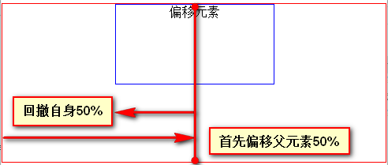
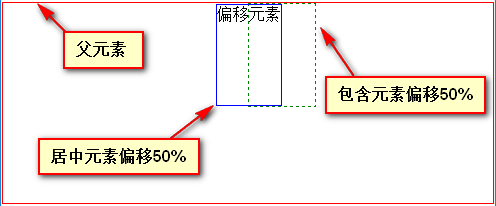
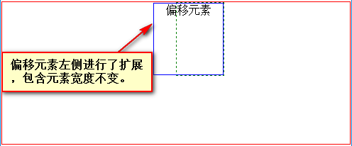
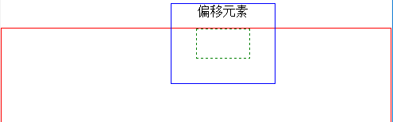
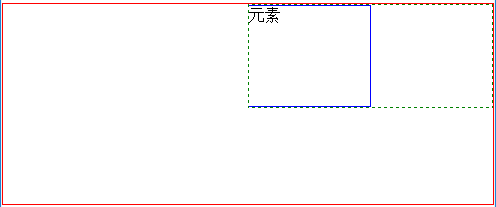

## 水平居中-偏移百分比方法总结
网上不少水平居中方法，主要为以下几种方法，
* text-align (inline-block)
* margin: auto
* flexbox 
* fit-content
  ...    

以上几种方法大家都很熟悉，这篇文章主要是个人总结下**偏移50%**的这类计算型居中方法，可简单理解为50% - 50%方法，针对的是非`inline`和`inline-block`的类型；     

这种类型方法基本原理是使元素偏移父元素宽度50%后回撤宽度的50%来居中，可利用`position` `float` `calc` `transform`等属性实现；      


根据是否已知居中（偏移）元素的宽度可分为两类。   

**HTML**
```html
<div class="contain">
     <div class="mid">偏移元素</div>
</div>
```

### 已知居中元素的宽度
以`position: absolute`为例：
<pre>
.mid {
     position: absolute;
     left: 50%;
     width: 200px;
     margin-left: -100px;  /*该元素宽度的1/2*/
}
</pre>
以`calc`为例：
<pre>
.mid {
     width: 200px;
     margin-left: calc(50% - 100px);  /*该元素宽度的1/2*/
}
</pre>
以`transform` 为例：
<pre>
.mid {
     width: 200px;
     margin-left: 50%;
     transform: translateX(-100px); /*该元素宽度的1/2，50%也可， 还可用于垂直居中*/
}
</pre>
当然偏移也可以换成`left`，不过`position`需要设置非`static`；
<pre>
.mid {
     position: relative;
     width: 200px;
     left: calc(50% - 100px);
}
</pre>
<pre>
.mid {
     position: relative:
     width: 200px;
     left: 50%;
     transform: translateX(-100px);
}
</pre>

### 未知居中元素宽度
除`transform`外，以上方法存在的问题是居中元素的`width`必须是已知的，对于未知`width`(比如内部动态的HTML)，大家首先考虑的是使用百分比，__但问题是无法在本元素的css中引用到本元素的宽度以及与其相关的百分比。__

**解决办法**就是：在父元素和偏移元素之间再**套一层包含元素**，让其宽度**一直等于**偏移元素的宽度，偏移元素的百分比就等同于自身的宽度，从而间接引用到偏移元素本身`width`，可以使用其百分比了；     

此时实现居中：使包含元素偏移之前父元素的50%，然后偏移元素偏移包含元素的50%（前提是偏移元素和包含元素的宽度相等），就可以达到居中效果。    

           

**那么，问题来了，如何使包含元素宽度等于偏移元素的宽度？**     

**其实就是包裹性!**   
设置包含元素以下属性即可。
* float
float会紧紧包裹内容，但是为了让偏移元素撑开包含元素，偏移元素不能使用absolute定位
* absolute
使用absolute可达到同样的包裹效果

**HTML**
```html
<div class="contain">
     <div class="addC">
          <div class="mid"></div>
     </div>
</div>
```

**float**
<pre>
.addC {
     float: left;
     margin-left: 50%;
}
</pre>
<pre>
.mid {
     position: relative;
     right: 50%; /*left:-50%*/
}
</pre>

**absolute**
<pre>
.addC {
     position: absolute;
     left: 50%;
     height: 200px;
     border: 1px dashed green;
}
</pre>
<pre>
.mid {
     position: relative;
     left: -50%;
}
</pre>
此时偏移元素的`left`不能换成`margin-left`，因为`margin-left`会使偏移元素左侧扩展，但包含元素宽度不变，使用负的`margin`都会进行扩展。     

**margin-left: -50%**     
       

**margin: -50%**     
    

再次使用**包裹性**可以防止扩展，可给偏移元素也设置`float`，但是不能设置`absolute`，因为使用绝对定位后包含元素无法撑开，百分比就失效了(包含元素的`position`如果为非`static` 时`width`会等于0，偏移为0，否则偏移会等于最近的非`static`的祖先的`width`的百分比，这不符合我们的情景)
<pre>
.mid {
     float: left;
     margin-left: 50%;
}
</pre>      


**问题**：如果要紧紧包裹内容，用`overflow:hidden`可以吗？     

`overflow`是用于父元素上解决`float`或者`position:absolute`无法撑开父元素用的，以上居中的情景下需要的是包含元素同子元素宽度相等，设置`overflow`并不能实现这种效果，反而会使包含元素宽度自适应父元素的宽度，而不是等于偏移元素动态的宽度；

**overflow: hidden**      


